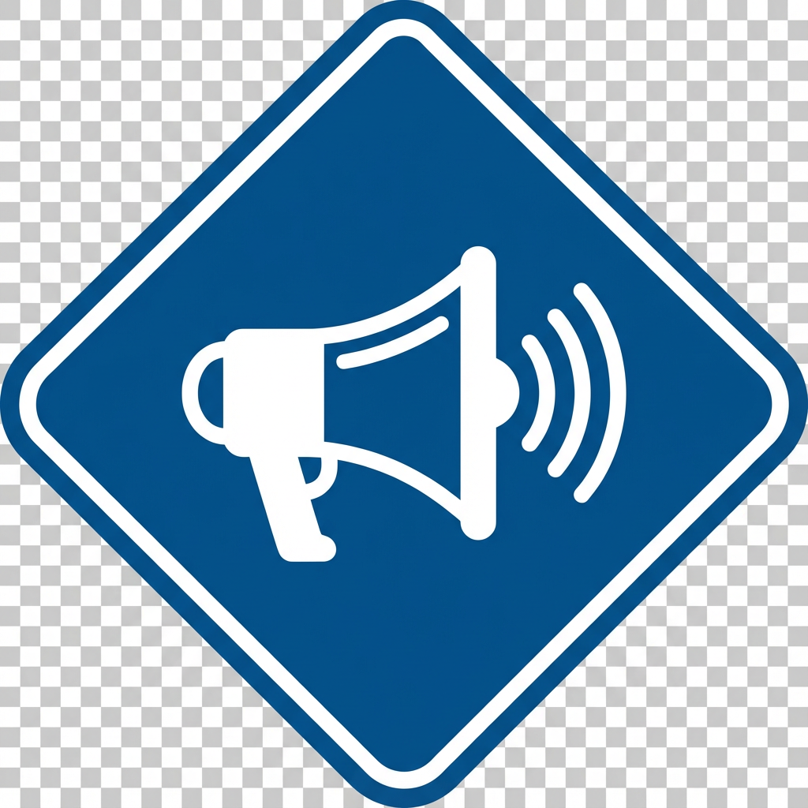
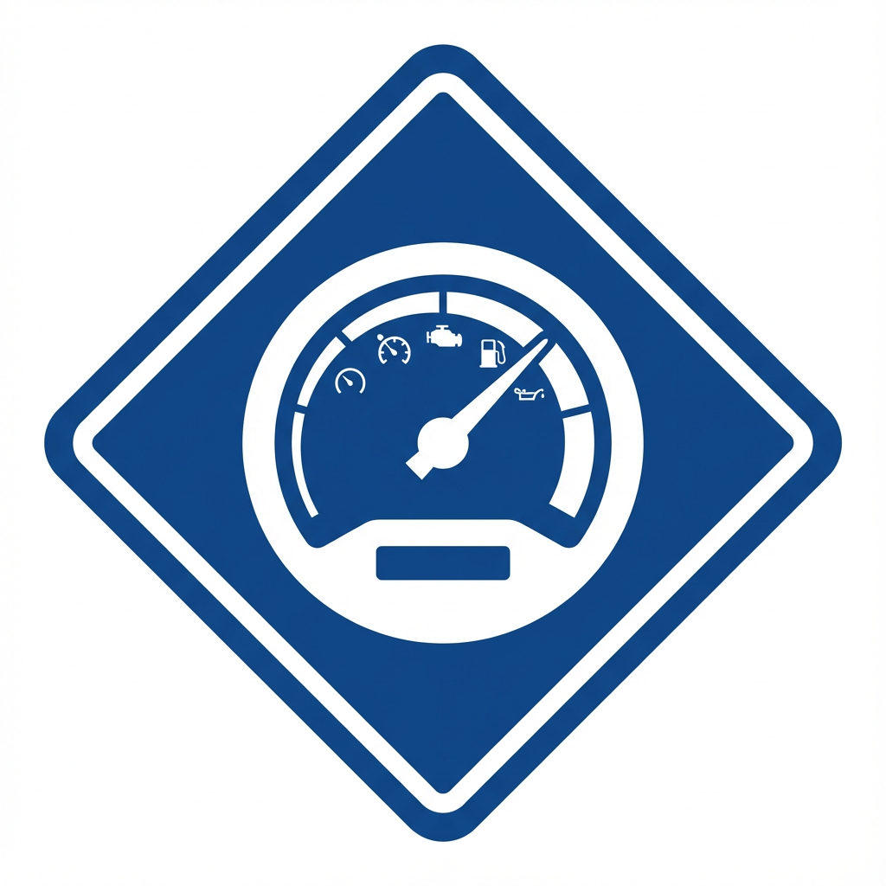
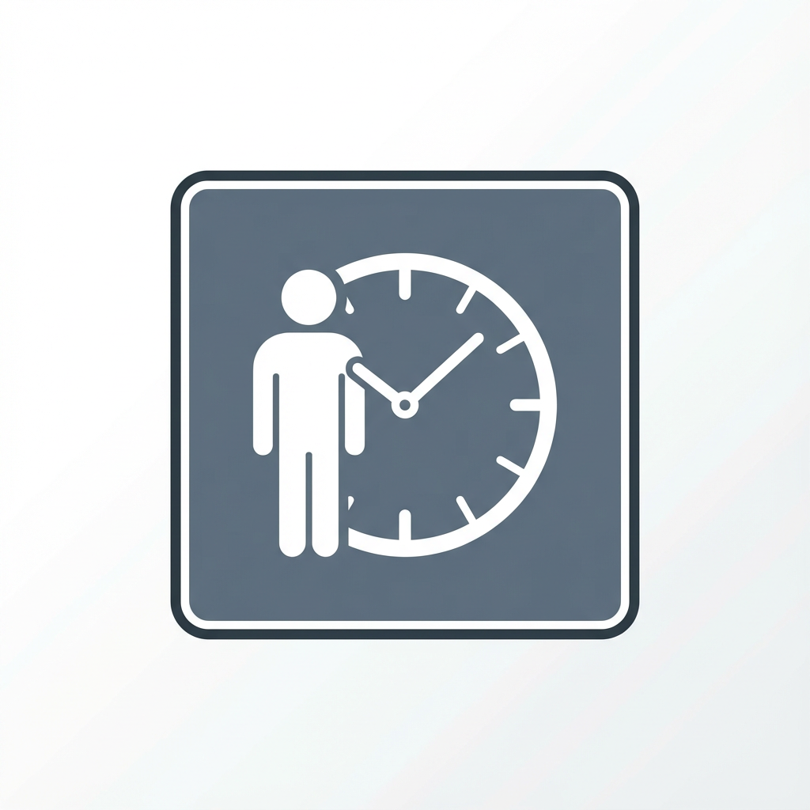
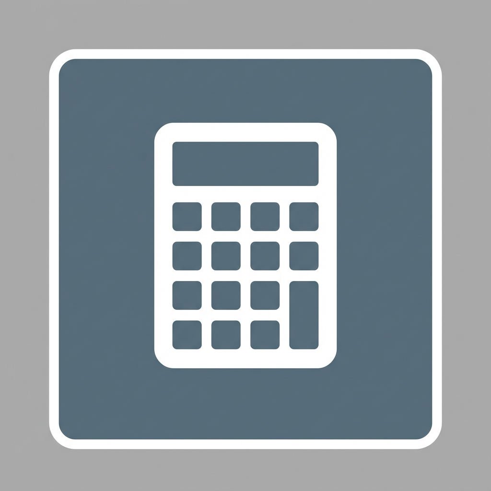
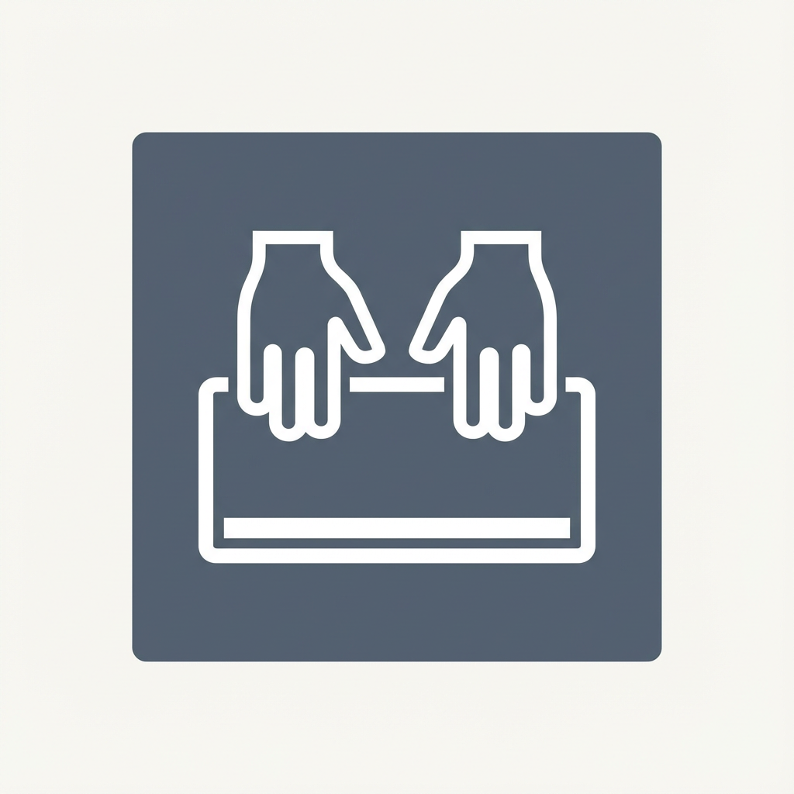

# AI 任務管理系統 - 交通標誌風格符號系統展示

## 設計理念

本符號系統參考交通標誌的設計原則,採用**高對比度、簡潔清晰、易於辨識**的視覺語言,讓使用者無需閱讀文字即可快速識別任務類型。

### 設計原則
- **顏色編碼**: 不同重要性等級使用不同顏色
- **形狀編碼**: 不同重要性等級使用不同形狀
- **圖案簡潔**: 白色圖案 + 彩色底,高對比度
- **一眼辨識**: 類似交通標誌,直覺式理解

---

## 一級 | 營收符號(金色圓形系列)

**設計特徵**: 金色/橙色圓形背景 + 白色圖案
**象徵意義**: 圓形代表完整、目標,金色代表價值、金錢

| 符號 | 名稱 | 關鍵字 | 圖片路徑 |
|------|------|--------|----------|
|  | 直接銷售 | 銷售、賣、業績、成交、訂單 | `/symbols/revenue/direct-sales.png` |
|  | 客戶拜訪 | 客戶、拜訪、會面、洽談、商談 | `/symbols/revenue/client-visit.png` |
|  | 簽約成交 | 簽約、合約、協議、成交、簽署 | `/symbols/revenue/contract-signing.png` |
|  | 產品展示 | 展示、產品、示範、介紹、呈現 | `/symbols/revenue/product-demo.png` |
|  | 報價提案 | 報價、提案、估價、價格、方案 | `/symbols/revenue/quotation.png` |
|  | 訂單處理 | 訂單、處理、下單、購買、採購 | `/symbols/revenue/order-processing.png` |
|  | 收款催款 | 收款、催款、付款、帳款、應收 | `/symbols/revenue/payment-collection.png` |
|  | 合約審核 | 審核、合約、檢查、確認、核對 | `/symbols/revenue/contract-review.png` |
|  | 定價策略 | 定價、價格、策略、訂價、成本 | `/symbols/revenue/pricing-strategy.png` |
|  | 營收分析 | 營收、分析、財務、收入、獲利 | `/symbols/revenue/revenue-analysis.png` |

---

## 二級 | 流量符號(藍色菱形系列)

**設計特徵**: 深藍色菱形背景 + 白色圖案
**象徵意義**: 菱形/箭頭代表方向、成長,藍色代表流動、擴展

| 符號 | 名稱 | 關鍵字 | 圖片路徑 |
|------|------|--------|----------|
|  | SEO 優化 | SEO、搜尋、優化、排名、關鍵字 | `/symbols/traffic/seo-optimization.png` |
|  | 社群經營 | 社群、粉絲、社交、互動、社團 | `/symbols/traffic/social-media.png` |
|  | 內容撰寫 | 內容、撰寫、文章、寫作、編輯 | `/symbols/traffic/content-writing.png` |
|  | 廣告投放 | 廣告、投放、行銷、推廣、宣傳 | `/symbols/traffic/advertising.png` |
|  | 數據分析 | 數據、分析、統計、報表、指標 | `/symbols/traffic/data-analysis.png` |
|  | 網站優化 | 網站、優化、改善、速度、體驗 | `/symbols/traffic/website-optimization.png` |
|  | 電郵行銷 | 電郵、郵件、EDM、信件、通知 | `/symbols/traffic/email-marketing.png` |
|  | 影片製作 | 影片、視頻、拍攝、剪輯、製作 | `/symbols/traffic/video-production.png` |
|  | 活動企劃 | 活動、企劃、策劃、規劃、舉辦 | `/symbols/traffic/event-planning.png` |
|  | 流量監控 | 流量、監控、追蹤、觀察、檢視 | `/symbols/traffic/traffic-monitoring.png` |

---

## 三級 | 行政符號(灰色方形系列)

**設計特徵**: 灰色方形背景 + 白色圖案
**象徵意義**: 方形代表規範、穩定,灰色代表中性、日常

| 符號 | 名稱 | 關鍵字 | 圖片路徑 |
|------|------|--------|----------|
|  | 文件審核 | 審核、文件、檢查、核准、批准 | `/symbols/admin/document-review.png` |
|  | 週報月報 | 週報、月報、報告、彙報、總結 | `/symbols/admin/weekly-report.png` |
|  | 流程優化 | 流程、優化、改善、精進、提升 | `/symbols/admin/process-optimization.png` |
|  | 會議安排 | 會議、安排、排程、預約、協調 | `/symbols/admin/meeting-scheduling.png` |
|  | 資料整理 | 資料、整理、歸檔、分類、彙整 | `/symbols/admin/data-organization.png` |
|  | 系統維護 | 系統、維護、保養、修復、更新 | `/symbols/admin/system-maintenance.png` |
|  | 人事管理 | 人事、管理、員工、人力、招聘 | `/symbols/admin/hr-management.png` |
|  | 預算編列 | 預算、編列、規劃、財務、經費 | `/symbols/admin/budget-planning.png` |
|  | 合規檢查 | 合規、檢查、稽核、法規、規範 | `/symbols/admin/compliance-check.png` |
|  | 文書處理 | 文書、處理、打字、輸入、登錄 | `/symbols/admin/document-processing.png` |

---

## AI 自動判別機制

當使用者輸入任務描述後,系統會自動分析關鍵字並匹配對應的符號:

### 判別範例

**輸入**: "撰寫Q4季度營收報告,分析各產品線銷售數據"
- **匹配關鍵字**: 營收、分析、銷售
- **判別結果**: 一級|營收 - 營收分析符號
- **符號**: 

**輸入**: "優化網站 SEO,提升搜尋排名"
- **匹配關鍵字**: SEO、優化、搜尋、排名
- **判別結果**: 二級|流量 - SEO 優化符號
- **符號**: 

**輸入**: "整理本週工作週報"
- **匹配關鍵字**: 週報、整理
- **判別結果**: 三級|行政 - 週報月報符號
- **符號**: 

---

## 使用建議

### 任務卡片顯示方式

建議在任務卡片上以**大尺寸符號**作為主視覺,搭配極簡文字:

```
┌─────────────────────────────┐
│  [符號圖標]                 │
│                             │
│  負責人 → 任務名稱          │
│  部門標籤 | 協作標籤        │
└─────────────────────────────┘
```

### 符號對照表(未來功能)

可在系統中新增「符號對照表」頁面,類似您提供的車輛檢修符碼對照表,讓使用者快速查詢符號意義。

---

## 技術實現

符號字典檔位置: `client/src/data/taskSymbols.ts`

核心函數:
- `matchTaskSymbol(taskDescription)`: 根據任務描述自動匹配符號
- `getSymbolsByCategory(category)`: 獲取特定分級的所有符號
- `getSymbolById(id)`: 根據 ID 獲取符號

---

## 下一步整合計畫

1. **任務卡片整合**: 在 TaskCard 元件中顯示符號圖標
2. **新增任務整合**: 在 CreateTaskDialog 中整合 AI 符號匹配
3. **任務排序**: 按照重要性排序(一級 → 二級 → 三級)
4. **符號對照表**: 新增獨立頁面展示所有符號

---

**請查看上方的符號設計,如果符合您的預期,我將繼續進行系統整合。如有需要調整的地方,請告訴我!**
